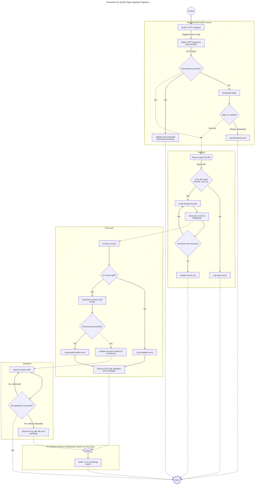

# LEI Explorer

A learning project to get properly fluent in Go through a real data engineering problem.
Built around [GLEIF](https://www.gleif.org/) LEI (Legal Entity Identifier) data: 2.3M+ legal
entities, daily delta updates, and ownership relationships.

---

## What I Want to Learn

- **Go concurrency**: goroutines, channels, worker pools, `errgroup`, `context` propagation
- **Go project structure**: `cmd/`, `internal/`, interfaces, separation of concerns
- **Streaming pipelines**: Redpanda (Kafka-compatible) producer/consumer, dead letter queues
- **gRPC in Go**: protobuf definitions, generated code, server-side streaming, interceptors
- **TDD in Go**: table-driven tests, `testcontainers-go` for integration tests
- **Recursive SQL**: `WITH RECURSIVE` for tree traversal (ownership chains)

---

## Use Cases

### Find a company by partial name

A user knows part of a company name and wants to locate it. Fuzzy search returns
ranked matches with LEI code, legal name, address, and status.

### Trace the ownership chain

Given a company, traverse the parent chain up to the ultimate owner. Useful for
finding who to contact for contracts, compliance checks, or due diligence.

### Daily delta updates

Every day GLEIF publishes a delta file with new, updated, and deactivated entities.
An ingestor fetches it, streams records through Redpanda, and upserts into the database.

---

## GLEIF Data

Three files, all freely available:

| File                | Description                                          |
| ------------------- | ---------------------------------------------------- |
| LEI-CDF golden copy | ~2.3M records, ~500MB CSV. One row per legal entity. |
| LEI-CDF delta       | Daily diff: new, updated, deactivated records.       |
| RR-CDF              | Relationship records: parent to child LEI mappings.  |

- Golden copy: `https://www.gleif.org/en/lei-data/gleif-golden-copy/download-the-golden-copy`
- GLEIF export links:
  <https://gist.githubusercontent.com/m8d3/6a188311e5f0c667854d2e64dd567046/raw/d66c8b7e4eb67c2007c869ca3968a7945e09b124/download-the-golden-copy.md>
- Level 1 LEI-CDF (LEI-CDF v3.1): <<https://leidata-preview.gleif.org/api/v2/golden-copies/publishes/lei2/latest.csv>
- Level 2 Relationship Record (RR-CDF v2.1):
  <https://leidata-preview.gleif.org/api/v2/golden-copies/publishes/rr/latest.csv>
- Level 2 Reporting Exceptions (Reporting Exceptions v2.1):
  <https://leidata-preview.gleif.org/api/v2/golden-copies/publishes/repex/latest.csv>

---

## Stack

| Concern       | Tool                               | Why                                                                    |
| ------------- | ---------------------------------- | ---------------------------------------------------------------------- |
| Database      | **PostgreSQL**                     | Records, fuzzy search (`pg_trgm`), ownership chains (`WITH RECURSIVE`) |
| Streaming     | **Redpanda**                       | Kafka-compatible, runs locally in Docker                               |
| API           | **gRPC**                           | Learning goal; mirrors real-world ML embedding service patterns        |
| Testing       | Go `testing` + `testcontainers-go` | TDD with real infra, no mocks for integration tests                    |
| Local infra   | **Docker Compose**                 | Single `docker compose up` to start everything                         |
| Language      | **Go**                             | The whole point                                                        |
| Observability | **Graphana**   + **Prometheus**    | Fetches metrics from Redpanda and creates aggregations on performance  |

---

## Architecture

## Features

### Resumability

The exports from GLEIF can be huge, more than 500 MB. There can be any number of reasons for the download to be broken.
The `downloader` should be able to resume the same file in that case without needing to restart.

### Observability

At a glance, an user should be able to see how different components of the system are performing. Recency of data,
failed ingestions, number of newly added companies, how many connections we were able to build etc should be available
in a dashboard.

### Idempotency

Since the data is from one/many external sources, duplicate data needs to be handled safely. All updates should be
idempotent without creating new entries.

### Error handling

Individual records failing should save the entries to DLQ with relevant metadata. However, only component level
issues should be logged to `stderr`. At worst the number of records processed might be at +2m, so preserving issues
regarding these all the while having TTL on them is necessary.

## Phases

### Phase 0 - Scaffolding and thin implementation

- [x] Initialize Go project with
    - [x] CLI entry point `cmd/ingestor/main.go` takes file path and prints records count
    - [x] Makefile for triggering pipeline
- [x] Add Dockerized infra
    - [x] PostgreSQL with `pg_trgm` extension
- [ ] `internal/store`: `Store` interface + PostgreSQL implementation
- [ ] Thin MVP
    - [ ] Stream opening of CSV files (LEI CDF)
    - [ ] Parser: 6 most obvious columns (not important)
    - [ ] Transform: with `goroutines` and preserve errors with `<-results` channel
    - [ ] Store: Save records to Postgres idempotently
    - [ ] Report: Full report at the end of parsing
    - [ ] Event log table
- [ ] Ingest full 2.3M record golden copy

### Phase 1 - Expand to relationships

- [ ] Relationship support
    - [ ] Stream open relationship file (RR-CDF)
    - [ ] Parse and transform records
    - [ ] Idempotently save relations to Postgres
    - [ ] Report at the end of parsing on both records and relationships
- [ ] Write and test recursive queries on PG
- [ ] Search
    - [ ] Lightweight fuzzy search via CLI
    - [ ] Show ownership chain in result

### Phase 2 - Stream process records

- [ ] Infra
    - [ ] Redpanda set up
- [ ] Producer: on top of same Parser module from Phase 0
- [ ] Consumer: on top of PG Store, bad records to `lei.dlq`
- [ ] Observability: DLQ counter on CLI report
- [ ] Integration test with `testcontainers-go`

### Phase 3 - API

- [ ] Define `lei_search.proto`, `protoc` Makefile target
- [ ] gRPC server: `GetEntity`, `SearchByName` (pg_trgm), `GetOwnershipChain` (streaming)
- [ ] Interceptors: logging (`log/slog`), timeout, panic recovery

### Phase 4 - MCP & Observability

- [ ] Expose gRPC search as an MCP server so AI agents can call `SearchByName` and `GetOwnershipChain` directly
- [ ] Infra:
    - [ ] Add Grafana and Prometheus to Docker
    - [ ] Expose health endpoint
- [ ] Observability:
    - [ ] Connect /health on processor and /metrics on Redpanda to Prometheus
    - Convert lightweight analytics of CLI to Graphana

### Phase 5 - Scheduled downloads

- [ ] Implement streaming download of GLEIF delta files
    - [ ] Records
    - [ ] Relationships
- [ ] Schedule daily triggers of download
- [ ] Download can be resumed on failure

---

## Go Conventions

- Errors propagate up: `log.Fatal` only in `main`, never in library code
- Interfaces at the boundary: `store.Store`, `stream.Producer` enable mock-free testing
- `context.Context` is always the first argument on I/O functions
- Table-driven tests for all unit tests
- `//go:build integration` tag on any test requiring Docker

## Readings

- Pipelines and cancellation (Go blog)
- `errgroup` pattern
- Download files in resumable fashion in Golang:
  <https://transloadit.com/devtips/build-a-resumable-file-downloader-in-go-with-concurrent-chunks/>
- Serve large files via HTTP: <https://oneuptime.com/blog/post/2026-01-30-how-to-handle-large-file-downloads-in-go/view>
