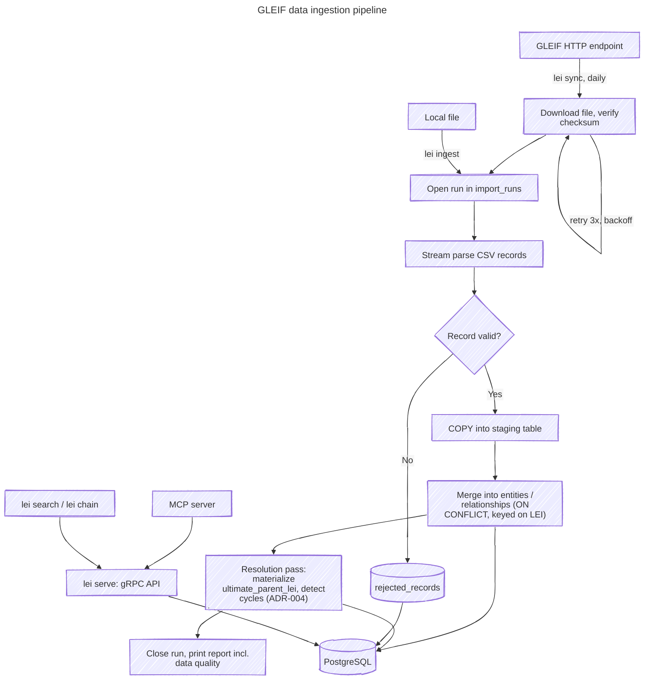

# Architecture

One binary, subcommands, sequential pipeline. Crash safety comes from durable state in
Postgres, not from process boundaries or a message broker.

## Diagram

```mermaid
---
title: GLEIF data ingestion pipeline
config:
        htmlLabels: false
        look: handDrawn
---
flowchart TB
    gleif[GLEIF HTTP endpoint] --> |lei sync, daily| download[Download file, verify checksum]
    download --> |retry 3x, backoff| download
    download --> run_start[Open run in import_runs]
    file[Local file] --> |lei ingest| run_start
    run_start --> parse[Stream parse CSV records]
    parse --> valid{Record valid?}
    valid --> |No| reject[(rejected_records)]
    valid --> |Yes| stage[COPY into staging table]
    stage --> merge["Merge into entities / relationships (ON CONFLICT, keyed on LEI)"]
    merge --> resolve["Resolution pass: materialize ultimate_parent_lei, detect cycles (ADR-004)"]
    resolve --> run_end[Close run, print report incl. data quality]

    merge --> pg[(PostgreSQL)]
    resolve --> pg
    reject --> pg
    serve[lei serve: gRPC API] --> pg
    mcp[MCP server] --> serve
    cli[lei search / lei chain] --> serve
```
